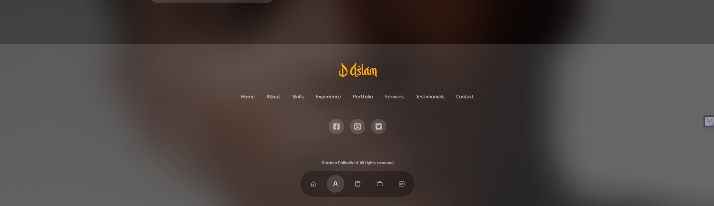

# D. Aslam
A personal portfolio website created with React.

## Overview
### Team Members
Aslam Dhikrullahi (Solo Project)
### Description
I, Aslam Dhikrullahi, with a product design background, aim to create a professional portfolio website to showcase my design work and skills. I will use the tools and skills obtained during the ALX-SE programme to create the portfolio website.

## Technologies Used
### React Framework
The website was developed using the React library, allowing for efficient and modular front-end development.
### HTML & CSS
Essential languages for structuring and styling the website's content.
### JavaScript
To add interactivity and dynamic elements to the website.

## The Journey
### Development
Over the past week, I have worked on creating several components for my React App. All I can say is, I enjoyed it, I got the feeling of completing a task you’ve pushed off for a long time.
### Successes
Before now, responsive design was always a thorn on my side, I would perfect the design of an App on one device and forget that other devices exists. On this project, I had been able to devise a good way to make my App responsive (had to refer back to some older alx lessons and YouTube).
### Challenges
The main challenge as stated earlier was the timeframe, However I overcame this due to the fact that I had the deadline staring me in the face.
### Areas for Improvement
I’d say I could improve in some areas, for example, using global css variables. Another thing is I had to make a lot of research during the project, but I believe most SE do this, the aim is to be one of those who don’t do it.
### Lessons Learnt
I did pick up a few things along the way, for example, how you can populate your elements using a declared data array. That’s just one of many things.
### Next steps
Well, my next steps would be to populate the website with real projects, right now I just populated the projects, testimonials and other sections with some generic data. After that, I will then host the site with my personal domain name.

## Screenshots

## Conclusion
Well, it was a good experience, first because, I love the fact that I could use ALX to push me to do a task I’ve been procrastinating about.
Another thing was I learnt several new things and how to do things in react, how to create global styling for your components, how to automatically create divs just by typing a classname, among others.
Again, it’s a very good experience, it’s something I’d love to do over again.

## Author
Aslam Dhikrullahi [`aslam-adigun`](https://github.com/aslam-adigun)